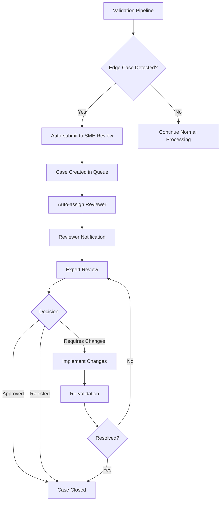

# SME Review Process for Edge Case Validation

## Overview

The SME (Subject Matter Expert) Review Process provides systematic review and validation of complex edge cases that require expert analysis beyond automated validation. This process ensures high-quality analysis of repositories with enterprise complexity, misleading signals, performance issues, and other challenging scenarios.

## Process Flow



## Edge Case Categories

### 1. Enterprise Complexity
- Large repositories (>10,000 files)
- Deep directory structures (>10 levels)
- Multi-language repositories
- Complex enterprise patterns

### 2. Language Edge Cases
- Mixed programming languages
- Unusual file extensions
- Language adapter failures
- Syntax parsing issues

### 3. Misleading Signals
- High-risk signal detection (>80% confidence)
- Architecture deception patterns
- Temporal anomalies
- Dependency risks

### 4. Performance Issues
- Analysis time >5 minutes
- Memory usage spikes
- Resource exhaustion
- Bottleneck identification

### 5. Analysis Accuracy
- Analysis failures
- Incorrect results
- Missing detections
- False positives/negatives

### 6. Security Concerns
- Potential security vulnerabilities
- Unsafe patterns detected
- Authority ceiling violations
- Governance signal conflicts

## Review Workflow

### 1. Case Submission
Edge cases are automatically identified and submitted by the validation pipeline:

```bash
# Manual submission example
python3 scripts/sme_review.py submit \
    --title "Enterprise Complexity Case" \
    --description "Large monorepo with complex structure" \
    --category enterprise_complexity \
    --repository-url "https://github.com/example/repo" \
    --expected "Analysis completes within 30s" \
    --actual "Analysis took 15 minutes" \
    --priority high
```

### 2. Reviewer Assignment
Cases are automatically assigned based on priority and availability:

```bash
# Manual assignment
python3 scripts/sme_review.py assign case_12345678 \
    --reviewer "expert@example.com" \
    --deadline-days 7
```

### 3. Expert Review
Reviewers analyze the case and provide detailed feedback:

```bash
# Submit review feedback
python3 scripts/sme_review.py feedback case_12345678 \
    --reviewer "expert@example.com" \
    --decision requires_changes \
    --confidence 4 \
    --findings "Complex enterprise patterns not handled optimally" \
    --recommendations "Implement specialized enterprise analysis pipeline" \
    --code-changes \
    --follow-up "Test with additional enterprise repositories"
```

### 4. Decision Outcomes

#### Approved ✅
- Case analysis is correct
- No changes required
- Case closed

#### Rejected ❌
- Case is not a valid edge case
- False positive detection
- Case closed

#### Requires Changes 🔧
- Analysis needs improvement
- Code/config changes required
- Follow-up actions specified
- Case remains open until resolved

## Review Criteria

### Decision Framework
Reviewers evaluate cases based on:

1. **Technical Accuracy**
   - Is the analysis result technically correct?
   - Are all relevant factors considered?
   - Is the risk assessment appropriate?

2. **Business Impact**
   - Does this affect production reliability?
   - Is this a common vs. rare scenario?
   - What is the cost of false positives/negatives?

3. **Improvement Potential**
   - Can the analysis be improved?
   - Are there systematic issues to address?
   - Should this trigger broader changes?

4. **Evidence Quality**
   - Is there sufficient evidence for the decision?
   - Are findings reproducible?
   - Is the confidence level justified?

### Confidence Levels
- **1-2**: Low confidence, needs more investigation
- **3**: Moderate confidence, reasonable assessment
- **4**: High confidence, strong evidence
- **5**: Very high confidence, definitive assessment

## Integration with CI/CD

The SME review process integrates with the continuous validation pipeline:

```yaml
# In .github/workflows/continuous-validation.yml
- name: Run SME review integration
  run: |
    ./ci/run_sme_review_integration.sh
```

### Automated Processing
1. Validation results are analyzed for edge cases
2. Cases are automatically submitted to review queue
3. Reports are generated and tracked
4. Overdue reviews are flagged
5. Optional auto-assignment based on configuration

## Reporting and Metrics

### Review Metrics
- Total cases submitted
- Average review time
- Approval/rejection rates
- Cases by category and priority
- Reviewer performance metrics

### Report Generation
```bash
# Generate comprehensive review report
python3 scripts/sme_review.py report --output-file reports/sme_review_20241228.md
```

### Queue Monitoring
```bash
# Check current review queue status
python3 scripts/sme_review.py queue
```

## Reviewer Guidelines

### For Reviewers
1. **Review thoroughly** - Examine all evidence and context
2. **Be specific** - Provide detailed findings and recommendations
3. **Consider impact** - Evaluate business and technical implications
4. **Document decisions** - Explain reasoning for transparency
5. **Follow up** - Ensure changes are implemented and tested

### For Engineers
1. **Provide context** - Include full analysis results and error details
2. **Be specific** - Clearly describe expected vs. actual behavior
3. **Prioritize** - Use appropriate priority levels
4. **Follow up** - Implement required changes and close cases

## Configuration

### Environment Variables
```bash
# Configure available reviewers for auto-assignment
export SME_REVIEWERS="expert1@example.com expert2@example.com"
```

### Review Deadlines
- **Critical**: 24 hours
- **High**: 3 days
- **Medium**: 7 days
- **Low**: 14 days

## Quality Assurance

### Process Metrics
- Review completion rate (>95%)
- Average review time (<5 days)
- Case resolution rate (>90%)
- False positive/negative rates tracked

### Continuous Improvement
- Regular review of process effectiveness
- Training for reviewers
- Updates to detection algorithms
- Refinement of review criteria

## Troubleshooting

### Common Issues
1. **Cases not being submitted**: Check validation pipeline output
2. **Reviewers not assigned**: Verify SME_REVIEWERS configuration
3. **Overdue reviews**: Check reviewer availability and adjust deadlines
4. **Report generation fails**: Ensure proper file permissions

### Support
- Check SME review logs in `sme_reviews/` directory
- Review CI/CD pipeline output
- Contact review coordinators for assignment issues